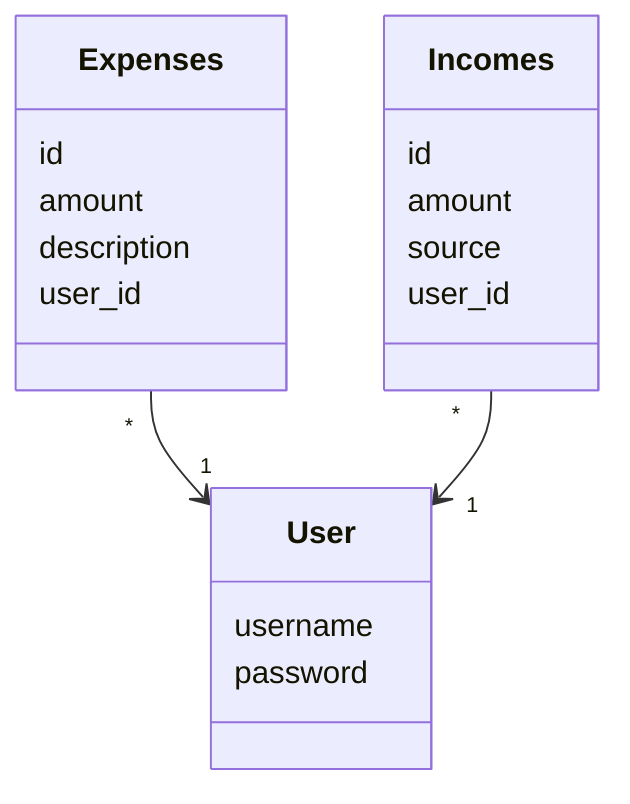
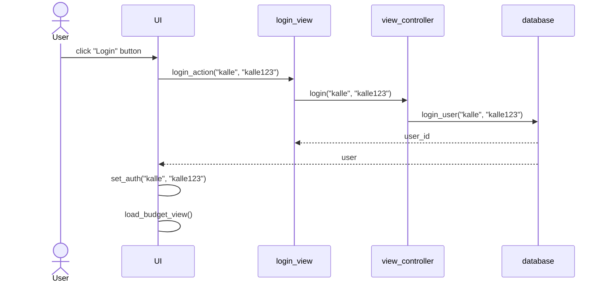
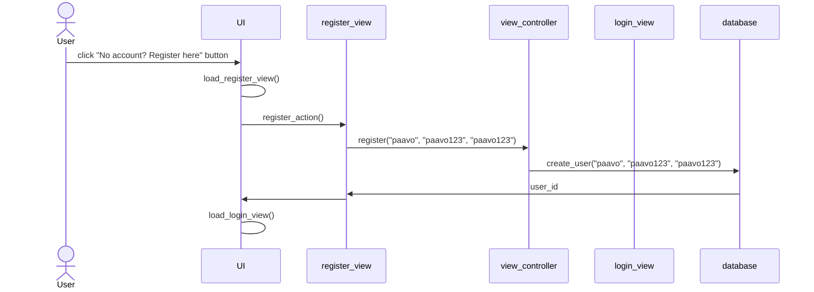
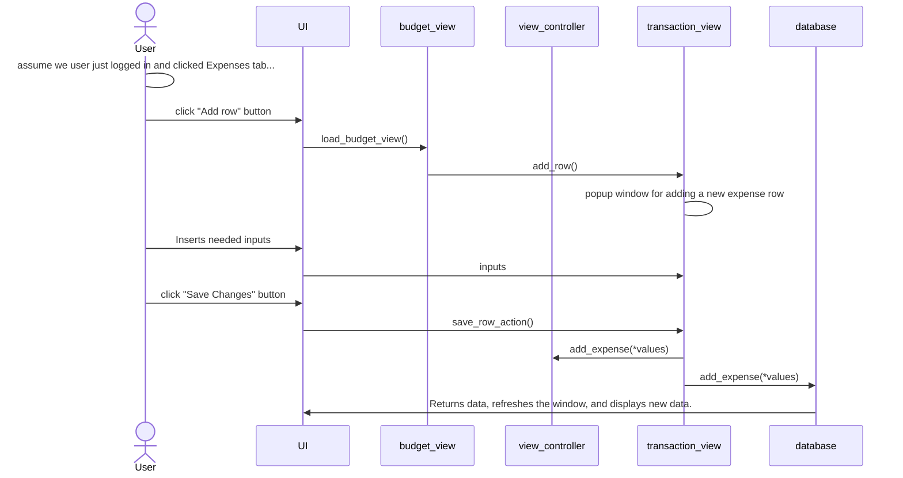

# Arkkitehtuurikuvaus

## Käyttöliittymä
Käyttöliittymä koostuu näkymistä:
- Kirjautuminen
- Kunnuksenluonti
- BudgetView
   -  avautuvat ikkunat:
      - tulon/menon lisääminen ja tietojen syöttäminen
      - tulon/menon muokkaaminen ja tietojen syöttäminen

## Sovelluslogiikka

## Tietojen tallennus
Ohjelmassa käytetään SQLite -tietokantaa, johon tallennetaan käyttäjän tiedot, sekä tuloihin/menoihin liittyvät tiedot

Tietokanta alustetaan build.py -tiedostossa

## Päätoiminallisuudet

### Käyttäjän kirjaantuminen

### Uuden käyttäjän luominen

### Tulon/kulun lisääminen
Tulon ja kulun lisääminen ovat lähes identtiset toiminallisuuksiltaan, siksi käsittelemme tässä vain tulon lisäämistä

## Ohjelman rakenteeseen ja toiminallisuuteen jääneet heikkoudet
   - Tulojen kokonaismäärän intuitiivinen näyttäminen puuttuu
   - Kulujen kokonaismäärän intuitiivinen näyttäminen puuttuu
   - Tulojen ja kulujen erotuksena olevan käteisvaran buginen näkymä
   - Käyttäjän kirjaantumista ei ole tuettu hashing -toteutuksella, eikä tarkisteta syötettyjen merkkien määrää. Käyttäjänimi ei ole uniikki 

