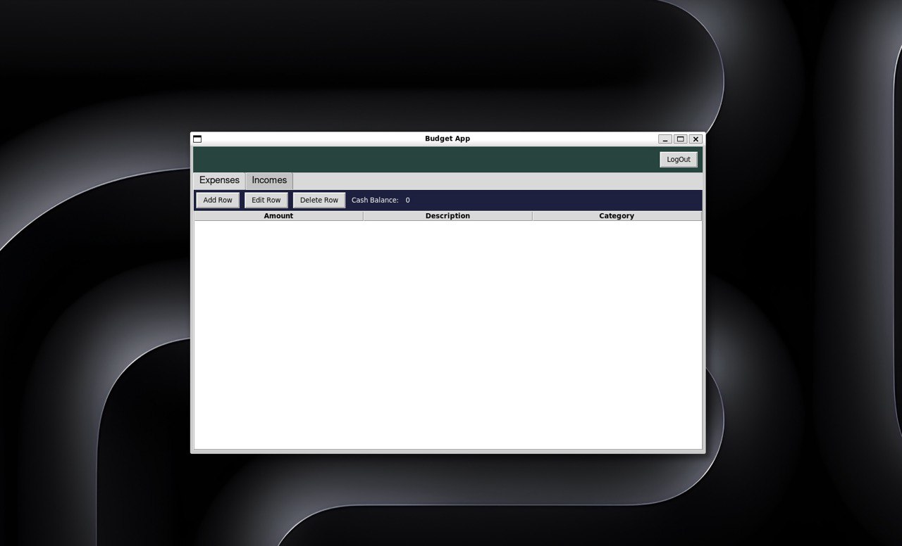

# Käyttoohje

Kun olet [asentanut ja tehnyt tarvittavat alustustoimenpiteet](https://github.com/keranenkirill/OT-projekti?tab=readme-ov-file#asennus).

## Kirjautuminen

Ohjelma avautuu kirjautumisikkunalla:

Jos on olemassa käyttäjä:

- käyttäjänimi
- salasana

## Käyttäjän luominen

Jos ei ole käyttäjää, siirrytään käyttäjän luomisesta vastaavaan ikkunaan painamalla nappia **_"No account? Register here"_**:

- käyttäjänimi
- salasana
- salasanan vahvistus

**_Back_** -napilla päästään takaisin kirjautumisnäkymään. 
**_Register your account_** -nappi vastaa käyttäjän luomisesta ja alustamisesta tietokantaan. Tästä siirrytään kirjautumissivulle, jossa käyttäjänimi on valmiiksi syötettynä.

## Päänäkymä
Kun kirjautuminen on onnistunut, avautuu ohjelman päänäkymä:

Päänäkymässä: 
**_LogOut_** -nappia painamalla kirjaudutaan ulos ja siirrytään kirjautumissivulle 
**_Expenses_** ja **_Incomes_** -tabeilla: 
   - **_Add Row_** -nappi vastaa kulun/tulon lisäämisestä
      - 
      - 
   - **_Edit Row_** -nappi vastaa kulun/tulon muokkaamisesta. Tämä onnistuu, kun valitaan haluttu muokattava kulu/tulo elementti näkymästä
      - 
      - 
   - **_Delete Row_** -nappi vastaa kulun/tulon poistamisesta tietokannasta ja näkymästä. Tämä onnistuu, kun valitaan haluttu poistettava kulu/tulo elementti näkymästä ja painetaan nappia
   - _**Cash Balance**_ -vastaa käteisvarasta joka jää tulojen ja kulujen erotuksesta
 