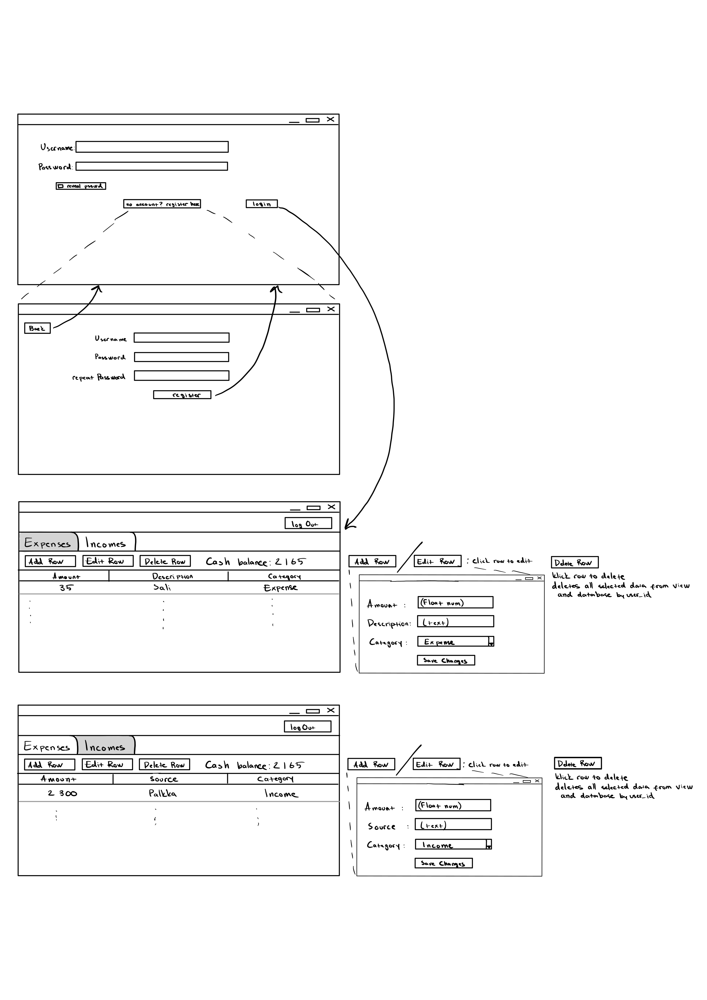

# Vaatimusmäärittely

## Sovelluksen tarkoitus

Sovelluksen avulla käyttäjien on mahdollista laskea tulot ja menot. 

## Käyttäjät

Sovelluksella on ainoastaan yksi käyttäjärooli. 

## Käyttöliittymäluonnos

Sovellus koostuu kuudesta eri näkymästä:

Sovellus aukeaa kirjautumisnäkymään, josta on mahdollista siirtyä uuden käyttäjän luomisnäkymään tai kirjautuneena päänäkymään.

## Perusversion tarjoama toiminnallisuus

### Ennen kirjautumista

- Käyttäjä voi luoda järjestelmään käyttäjätunnuksen
- Käyttäjä voi kirjautua järjestelmään
  - Kirjautuminen onnistuu syötettäessä olemassaoleva käyttäjätunnus ja salasana kirjautumislomakkeelle
  - Jos käyttäjää ei olemassa, tai salasana ei täsmää,niin ilmestyy virheviesti

### Kirjautumisen jälkeen

- Käyttäjä näkee oman budjetti näkymän
- Käyttäjä voi luoda uuden butjetin
  - Luotu budjetti näkyy ainoastaan sen luoneelle käyttäjälle
- Käyttäjä voi lisätä/poistaa tuloja ja menoja
- Käyttäjä voi kirjautua ulos järjestelmästä
- Tulojen ja kulujen erotuksena jäävä käteisvara näkyy käyttäjälle

## Jatkokehitysideoita
- Käyttäjätunnuksen täytyy olla uniikki
- Oleamassa olevien yksittäisten tulojen/menojen muokkaaminen 
- Käyttäjätiimit, jotka näkevät kaikki yhteiset budjetit
- Mahdollisuus useampaan erilliseen budjettinäkymään
- Käyttäjätunnuksen poisto kaikkineen tietoineen
- Graaffista sisältöä (charts)