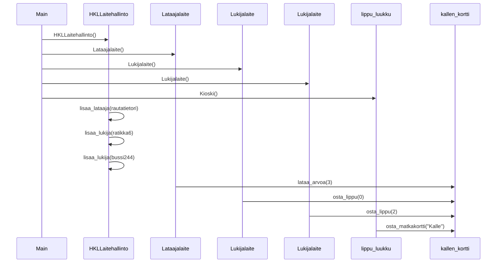

```mermaid
   sequenceDiagram
      participant main as Main
      participant laitehallinto as HKLLaitehallinto
      participant rautatietori as Lataajalaite
      participant ratikka6 as Lukijalaite
      participant bussi244 as Lukijalaite
      
      main ->> laitehallinto: HKLLaitehallinto()
      main ->> rautatietori: Lataajalaite()
      main ->> ratikka6: Lukijalaite()
      main ->> bussi244: Lukijalaite()
      main ->> lippu_luukku: Kioski()
      laitehallinto ->> laitehallinto: lisaa_lataaja(rautatietori)
      laitehallinto ->> laitehallinto: lisaa_lukija(ratikka6)
      laitehallinto ->> laitehallinto: lisaa_lukija(bussi244)
      
      rautatietori ->> kallen_kortti: lataa_arvoa(3)
      ratikka6 ->> kallen_kortti: osta_lippu(0)
      bussi244 ->> kallen_kortti: osta_lippu(2)
      lippu_luukku ->> kallen_kortti: osta_matkakortti("Kalle")   
```

