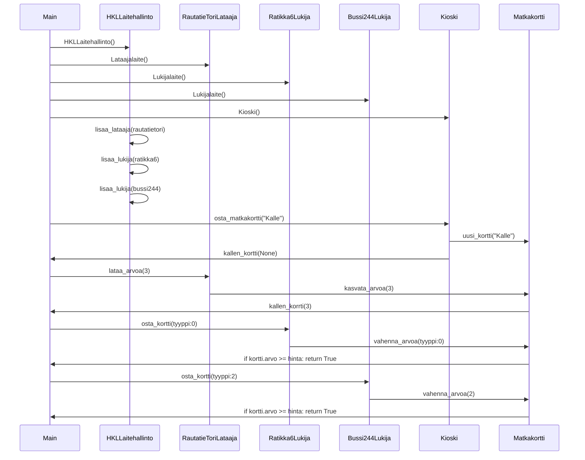

```mermaid
   sequenceDiagram
      participant main as Main
      participant laitehallinto as HKLLaitehallinto
      participant rautatietori as RautatieToriLataaja
      participant ratikka6 as Ratikka6Lukija
      participant bussi244 as Bussi244Lukija
      participant lippu_luukku as Kioski
      participant kallen_kortti as Matkakortti
      
      main ->> laitehallinto: HKLLaitehallinto()
      main ->> rautatietori: Lataajalaite()
      main ->> ratikka6: Lukijalaite()
      main ->> bussi244: Lukijalaite()
      main ->> lippu_luukku: Kioski()
      
      laitehallinto ->> laitehallinto: lisaa_lataaja(rautatietori)
      laitehallinto ->> laitehallinto: lisaa_lukija(ratikka6)
      laitehallinto ->> laitehallinto: lisaa_lukija(bussi244)


      main ->> lippu_luukku: osta_matkakortti("Kalle")
      lippu_luukku ->> kallen_kortti: uusi_kortti("Kalle")
      lippu_luukku ->> main: kallen_kortti(None)
      

      main ->> rautatietori: lataa_arvoa(3)
      rautatietori ->> kallen_kortti: kasvata_arvoa(3)
      kallen_kortti ->> main: kallen_korrti(3)

      main ->> ratikka6: osta_kortti(tyyppi:0)
      ratikka6 ->> kallen_kortti: vahenna_arvoa(tyyppi:0)
      kallen_kortti ->> main: if kortti.arvo >= hinta: return True

      main ->> bussi244: osta_kortti(tyyppi:2)
      bussi244 ->> kallen_kortti: vahenna_arvoa(2)
      kallen_kortti ->> main: if kortti.arvo >= hinta: return True
      
```

