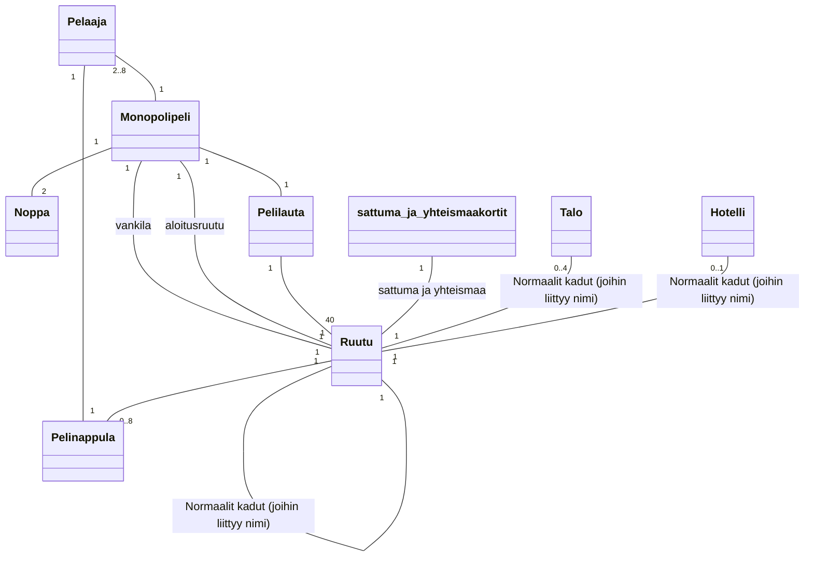

## Monopoli, alustava luokkakaavio

```mermaid
 classDiagram
    Pelaaja "2..8" -- "1" Monopolipeli
    Pelaaja "1" -- "1" Pelinappula  
    Monopolipeli "1" -- "2" Noppa
    Monopolipeli "1" -- "1" Pelilauta
    
    Monopolipeli "1" -- "1" Ruutu : vankila
    Monopolipeli "1" -- "1" Ruutu : aloitusruutu
    Pelilauta "1" -- "40" Ruutu

    Ruutu "1" -- "0..8" Pelinappula
    Ruutu "1" -- "1" Ruutu : seuraava ruutu
    Ruutu "1" -- "1" Ruutu : asemat ja laitokset
    Ruutu "1" -- "1" Ruutu : Normaalit kadut (joihin liittyy nimi)
    sattuma_ja_yhteismaa kortit "1" -- "1" Ruutu : sattuma ja yhteismaa
    
    Talo  "0..4" -- "1" Ruutu : Normaalit kadut (joihin liittyy nimi)
    Hotelli  "0..1" -- "1" Ruutu : Normaalit kadut (joihin liittyy nimi)
   
```