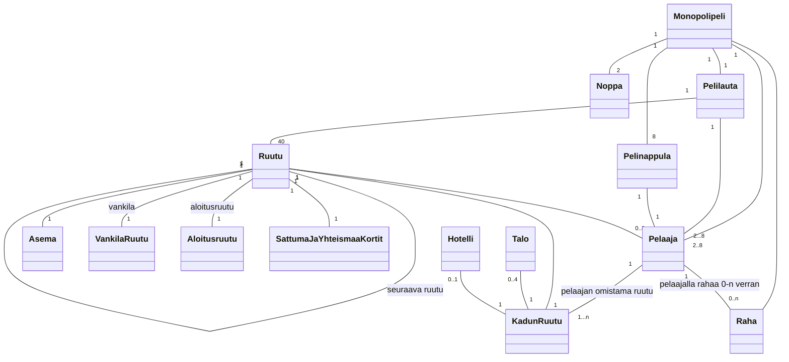

## Monopoli, alustava luokkakaavio

```mermaid
 classDiagram
    Monopolipeli "1" -- "2..8" Pelaaja
    Monopolipeli "1" -- "8" Pelinappula  
    Monopolipeli "1" -- "2" Noppa
    Monopolipeli "1" -- "1" Pelilauta
    Monopolipeli "" -- "" Raha
    
    Pelilauta "1" -- "40" Ruutu
    Pelilauta "1" -- "2...8" Pelaaja

    Pelinappula "1" -- "1" Pelaaja

    Pelaaja "1" -- "1...n" KadunRuutu: pelaajan omistama ruutu
    Pelaaja "1" -- "0..n" Raha: pelaajalla rahaa 0-n verran
    
    Ruutu "1" -- "0..8" Pelaaja
    Ruutu "1" -- "1" Ruutu : seuraava ruutu
    Ruutu "1" -- "1" Asema
    Ruutu "1" -- "1" VankilaRuutu : vankila
    Ruutu "1" -- "1" Aloitusruutu : aloitusruutu
    Ruutu "1" -- "1" KadunRuutu
    Ruutu "1" -- "1" SattumaJaYhteismaaKortit

    Talo  "0..4" -- "1" KadunRuutu
    Hotelli  "0..1" -- "1" KadunRuutu
   
```